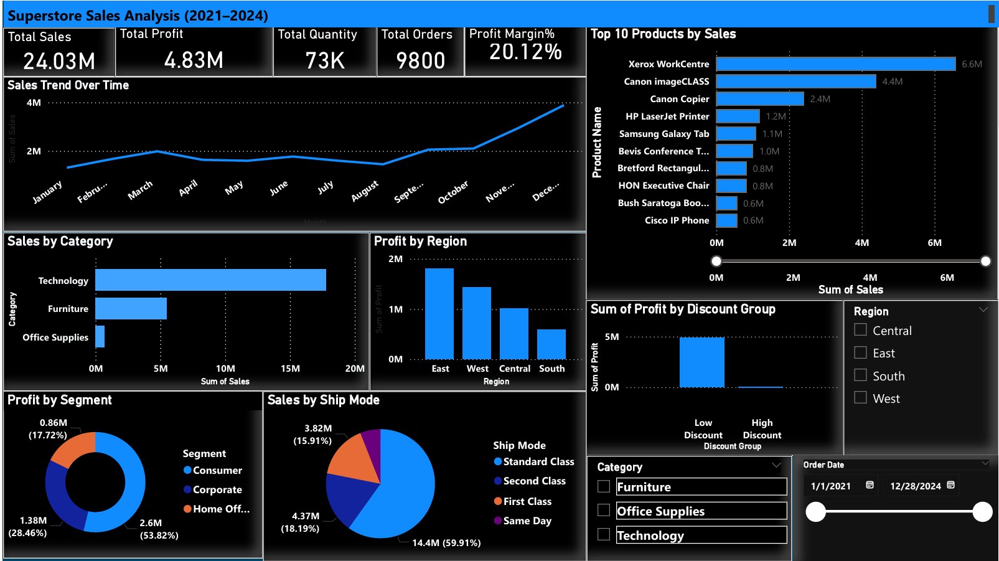

# Sales Performance Analytics Project

This is my data analysis project on a retail superstore's sales data from 2021 to 2024.
I did this project to practice end to end data analysis using Python and Power BI.

---
## Dashboard Preview



## Key Insights

- East region leads with $8.84M in sales — 37% of total revenue
- Q4 generates 1.8x more sales than Q1 every year — clear seasonal peak
- Discounts above 30% produce negative profit on average (-$223 per order)
- Office Supplies has the highest profit margin at ~30% despite lower sales volume
- Consumer segment drives 52% of orders but Corporate has comparable margins

## About the Project

I took a superstore sales dataset and tried to answer some important business questions like:
- Which region is performing best?
- Which product categories are most profitable?
- Are discounts actually helping or hurting the business?
- How is the business growing year over year?

---

## Dataset

- **File:** superstore_sales.csv
- **Rows:** 9,800 orders
- **Time Period:** January 2021 to December 2024
- **Columns:** Order ID, Order Date, Ship Date, Ship Mode, Customer details, Region, State, Category, Sub-Category, Product Name, Sales, Quantity, Discount, Profit

---

## Tools Used

- Python 3
- Pandas (data cleaning and analysis)
- NumPy (calculations)
- Matplotlib and Seaborn (charts and visualization)
- Jupyter Notebook
- Power BI Desktop (interactive dashboard with slicers and KPI cards)

---

## Project Structure

```
sales-performance-analytics/
|
|-- superstore_sales.csv                  # dataset
|-- sales_performance_analysis.ipynb      # main analysis notebook
|-- Sales_Performance_Analytics.pbix      # power bi dashboard file
|-- dashboard_preview.png                 # dashboard screenshot
|-- sales_performance_analytics.pdf       # exported pdf report
|-- charts/                               # all charts saved here
|   |-- 01_monthly_sales_trend.png
|   |-- 02_region_sales_profit.png
|   |-- 03_category_performance.png
|   |-- 04_subcategory_sales.png
|   |-- 05_segment_split.png
|   |-- 06_yoy_growth.png
|   |-- 07_discount_vs_profit.png
|   |-- 08_quarterly_heatmap.png
|   |-- 09_shipping_analysis.png
|-- README.md
```

---

## Analysis Done

1. **Monthly Sales Trend** - plotted sales over all months from 2021 to 2024 to see the trend
2. **Year-wise Sales vs Profit** - compared how sales and profits grew each year
3. **Region-wise Performance** - checked which region is generating most revenue
4. **Category Analysis** - compared Technology, Furniture and Office Supplies categories
5. **Sub-Category Analysis** - top 10 sub categories by sales and their profit
6. **Customer Segment Analysis** - Consumer, Corporate and Home Office comparison
7. **Discount vs Profit** - this was the most interesting part, high discounts are causing losses
8. **Quarterly Heatmap** - visualized quarterly patterns across years
9. **Shipping Mode Analysis** - which shipping mode is used most and average delivery days

---

## Key Findings

- East region has highest sales
- Q4 is always the strongest quarter (around 1.8x more than Q1)
- Office Supplies has the best profit margin even though Technology has more total sales
- Orders with discount above 30% are actually losing money (negative profit on average)
- Consumer segment drives 52% of total sales
- Standard Class is used for 59% of orders but takes 5-7 days

---

**Vipin Pandey**  
MCA (Data Science) | UPES Dehradun  
[LinkedIn](https://linkedin.com/in/vipin-pandey-21810328a)
[GitHub](https://github.com/vipinpandey789)
